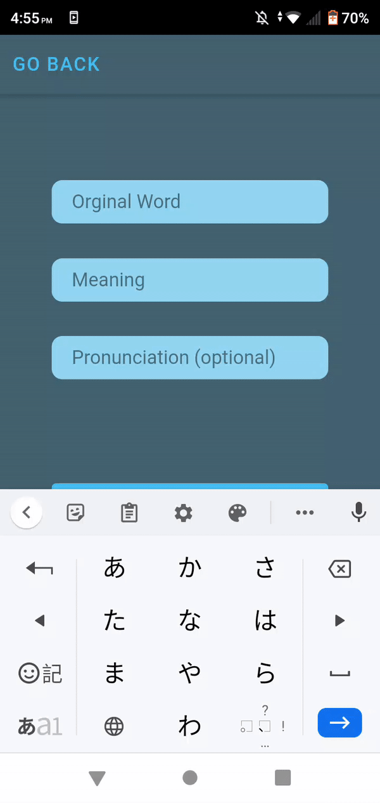
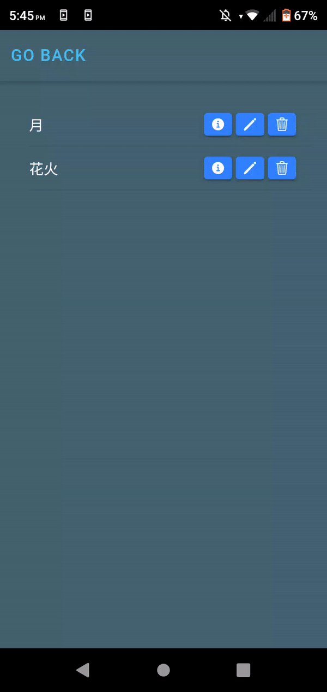
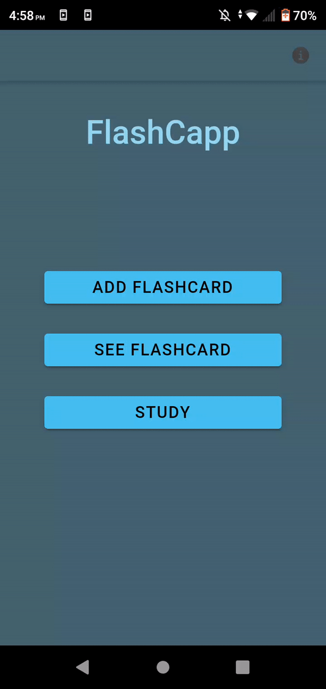

 <h1 align="center">FlashCapp</h3>
 
<b>An application to store and study language flashcards</b>

  
<h1>Content</h1>
<ul>
 <li><a href="#users">What can you do<a/></li>
 <li><a href="#insta">Installation<a/></li>
 <li><a href="#made">Made With<a/></li>
</ul>
 
 <h2 id="uses"><b>What can you do?</b></h2>
 
Here are all the uses of FlashCapp.
 <h3 align="center">Add a Flashcard</h3>
 
Add a new word to the app, place the word in the language you are studying in the Original Word field; The translation of the word in the meaning and if it has a pronunciation place it in the pronunciation field

 <!-- Add image or gif-->
 

  
 

 <h3 align="center">Manage your flashcards</h3>
 
See all your already created flashcards, edit them, and delete them.

 <!-- Add image or gif-->

  
 

 <h3 align="center">Study them!</h3>
 
Get random flashcards from your list and practise them. Tap on the card to get the meaning and pronunciation.

 <!-- Add image or gif-->
 

  
 

  
 <h2 id="insta">Installation</h2>
 
If you want to use this app download the latest <a href="https://github.com/IvanTorres21/FlashCappIonic/releases/tag/2.0">apk</a> in your phone and open it to install the app.

  
 <h2 id="made">Made with</h2>
 
This application was done with <a href="https://ionicframework.com/">Ionic 4</a>
 <h2 id="now">What now?</h2>
 
We will be adding this features to FlashCapp:

 <ul>
 <li>Groups for your flashcards! ✔</li>
 <li>Writing practice!</li>
 <li>Choose the amount of flashcard you want to study</li>
 </ul>
